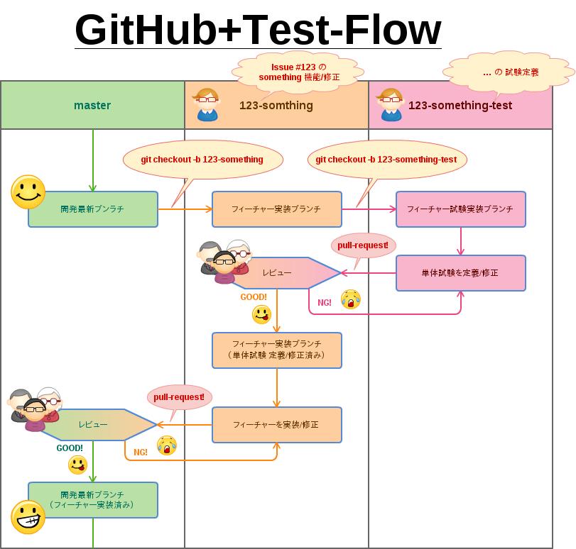

# GitHub+Test-Flow

GitHub+Test-Flow は GitHub-Flow を基本として、テスト定義ブランチを明示的にプルリクエスト駆動で加えたソフトウェア開発用のフローです。

## 図解

## 文字列解

- GitHub-Flow を基とする
- `master` ブランチは常に動作可能な開発最新版の状態を保つ
    - 但し、 `master` は直ちにデプロイではなく、masterブランチの適当なタイミングでリリースタグを適切に打ち、タグ付けされたコミットを基にデプロイは別途行う
- 機能追加/修正は先に GitHub Issues へチケットを出し必要性の検討など十分に行い設計の追加や仕様変更を明確に定義する
    - 開発者はIssue を基に `master` から `123-something` ブランチを切る
        - `123-something` から `123-something-test` ブランチを切り単体試験を定義/修正する
        - `123-something-test` から `123-something` へプルリクエストを行いレビューを受け、必要な修正の後にマージする
    - 機能実装を行い単体試験を全てクリア、余力に応じてリファクタリングする
    - `123-something` から `master` へプルリクエストを行いレビューを受け、必要な修正の後にマージする

